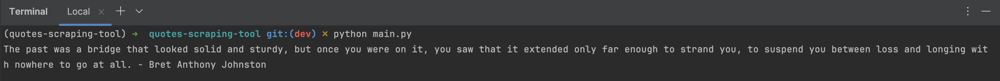
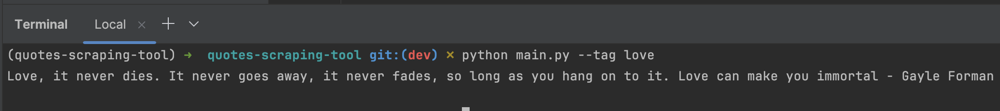

# Quote Scraping Tool: A Python-based Quote Scraper

## Introduction

Welcome to **Quote Scraping Tool (QST)**, an open-source project designed to introduce enthusiasts to the world of open source
participation. This project focuses on extracting and providing random quotes from popular quotation website.
Whether you're an experienced developer or a novice seeking to make your first contribution, this project provides an
appealing and welcoming atmosphere to begin your adventure.

## Features

At its core, this project allows you to:
- **Fetch a Random Quote**
- **Fetch Quotes by Tags**

Built using Python 3.11, this project is designed to be simple yet extensible.

## Upcoming Features & Ideas for Contribution

The project roadmap is loaded with potential. We're looking forward to the following features:
- Additional Quote Providers: We're expanding our sources outside Goodreads.
- Quote Sharing: Implement the ability to share quotes with others.
- Improving documentation: Improving current documentation by fixing language, spelling, and punctuation, as well as improving text clarity and readability.
- Documentation translating: Translating documentation into multiple languages can make a project more accessible, extending its reach and usability.
- Web API Integration: Implement RESTfull routes to expose quotes over a web API.

We are also open to new suggestions! We'd love to hear your ideas for improving GoodQuotes.

## Getting Started

### Prerequisites

Before you begin, ensure you have[Python 3.11+](https://www.python.org/downloads/) installed on your machine. You may
need to install a Python environment manager tool to separate project requirements. I personally prefer 
[mini conda](https://docs.anaconda.com/free/miniconda/miniconda-install/), but you can install [venv](https://docs.python.org/3/library/venv.html), 
[virtualenv](https://virtualenv.pypa.io/en/latest/index.html), [pipenv](https://pipenv.pypa.io/en/latest/), or any other option that meets your needs. 

### Installation

Clone the repository:

```bash
git clone https://github.com/blablageeks/quotes-scraping-tool.git
cd quotes-scraping-tool
```

Create and enable the project environment for packages isolation

```shell
conda create --name quotes-scraping-tool python=3.11
conda activate quotes-scraping-tool
```

Install the required dependencies:

```bash
pip install -r requirements.txt
```

### Usage

To fetch a random quote:

```shell
python main.py
```

To fetch a random quote from a specific tag:

```shell
python main.py --tag [tag-name]
```
Available tags (for GoodReads Provider only) are `religion`, `love`, `inspiration`, `god`, and `success`

## Demo

Run `python main.py`command in your terminal to get a random quote from GoodReads Quote site



Run `python main.py --tag love` command in your terminal to get a random `love` quote from GoodReads site



## How to Contribute

Contributing to GoodQuotes is straightforward:

1. **Fork the Repository**: Start by forking the repository to your GitHub account.
2. **Create an Issue**: If you have an idea or find a bug, open an issue to discuss it.
3. **Work on a Feature or Bug**: Choose an existing issue and start working on it.
4. **Submit a Pull Request**: Once you're done, submit a pull request for review.

Check out [CONTRIBUTING.md](./CONTRIBUTING.md) for detailed guidelines on contributing.

## License

## Quotes providers
- [x] [Good Reads](https://www.goodreads.com/quotes)
- [ ] [Brain Quotes](https://www.brainyquote.com/)
- [ ] [Az Quotes](https://www.azquotes.com/)
- [ ] [Quotation Page](http://www.quotationspage.com/)
- [ ] [The Quote Garden](https://www.quotegarden.com/)
- [ ] [Quote Fancy](https://quotefancy.com/)
- [ ] [Wisdom Quotes](https://wisdomquotes.com/)
- [ ] [Insight of the day](https://www.insightoftheday.com/)
- [ ] [Though Quotations](https://www.thoughtco.com/quotations-4133229)
- [ ] [Wiki Quotes](https://www.wikiquote.org/)

This project is released under the [MIT License](./LICENSE).
